# 墨年（InkYear）软件项目开发文档

## 一、项目需求分析

### 1.1 开发背景

- 在生活节奏日渐加快的现代社会，“记录”的作用愈发凸显。定期对自己进行记录和自我审视，是观察自己的一种方式，从而达到了解自己、掌握生活以及自律的目的。许多人开始有意识的记录自己生活中的大小事来抓住转瞬即逝的每一天，让自己的流逝的时间留下痕迹。传统的写日记以及近年来流行起来的手账本是目前主要的记录方式。然而在分秒必争的今天，这两种方式所耗费的时间和精力不是每个人都能负担，以至于真正坚持下来的人少之又少。为了让想记录生活，记录成长的人能更简便、高效、又不失美观的进行记录，结合当今互联网时代的特点，墨年（Ink Year）应运而生。

### 1.2 产品简介

- 墨年（Ink Year）是一款以“碎片化时间记录美好生活”为主题的轻量级生活记录类APP。它通过向用户提供多样化的卡片模板，使用户可以以选项选择、文字输入、图片插入等形式简便、高效的记录生活点滴。用户的输入内容，将进行分类并以智能化形式进行同步可视化呈现。每周一，用户可获得上周的记录的总体报告以及卡片时间线回顾，用户可进行对记录进行分享以及下载保存。墨年（Ink Year）为有记录需求的用户提供了一个系统化的平台，减少用户的记录排版、保存、分类等问题，引导用户更高效的记录生活。

### 1.3 竞争分析

- 记录方式
  - 日记：
    - 优点 成本低，纸笔即可进行记录
    - 缺点 平均耗时较长；地点限制较大；纯文字记录；隐私泄露风险
  - 手账：
    - 优点 图文结合，很强的美观性；DIY自由度很
    - 缺点 平均耗时较长；对美术功底有要求；材料成本较高
  - 墨年：
    - 优点 耗时较短；图文结合；隐私保护；随时可记录；美观模板可选择
    - 缺点 DIY自由度一般
- 同类APP
  - 卡片日记：
    - 优点 界面简洁；操作简便；图文结合 
    - 缺点 没有标签分类；一天只能记录一件事情，记录功能不全面
  - 格志日记：
    - 优点 界面简洁；操作便捷；记录形式丰富；日记本形式储存；图文结合；时间线查看记录；记录功能全面
    - 缺点 排版较冗杂；事件堆积没有分类功能
  - Perspective：
    - 优点 操作简便；记录功能到位；引导式记录；省时
    - 缺点 界面美观性不足；问题无法自定义；记录呈现形式需自行排版整理；交互体验一般
  - iCity我的日记：
    - 优点 界面精美；社区互动功能 
    - 缺点 记录功能不全面；开放式记录带来记录干扰，隐私性不足；其他功能喧宾夺主
  - Daylio：
    - 优点 心情记录；PIN码隐私保护；免输入，图标选择代替；操作简便；数据统计
    - 缺点 记录功能局限性大，免掉输入但导致不能记录具体事件
  - DayOne:
    - 优点 图文结合；音频记录；标签分类；日记本形式储存；时间线查看记录
    - 缺点 全英文；用户需自行排版；记录形式单一（只有输入类）
  - DayGram:
    - 优点 界面简洁水墨风；时间线查看记录；隐私保护（密码）；图文记录
    - 缺点 图片功能鸡肋（只能一张图）；本地储存，数据丢失风险
  - Mori手账：
    - 优点 编辑自由度高；图文贴图装饰结合，美观性强；素材库齐全
    - 缺点 耗时较长；图片插入

### 1.4 发展前景

- 目前市场上生活记录类APP很多，但是注重记录功能而不失美观的同类软件只有个别。大部分APP仍存在忽略用户记录体验以及软件的功能专注性，过多的功能使得软件显得冗杂或者达不到记录的目的。墨年围绕“碎片化时间”以及“记录”两个关键词，引导用户进行高效率而全面的记录，综合了市面上APP的优点并改善了其中的不足。在未来发展中，墨年可以在交互上进行更智能的的升级，增加更细致的数据处理，让用户记录的时候能得到同步的综合反馈，有助于用户利用所记录的数据进行自我分析和改进。

## 二、项目开发框架

### 2.1 架构流程

- 用例图  
  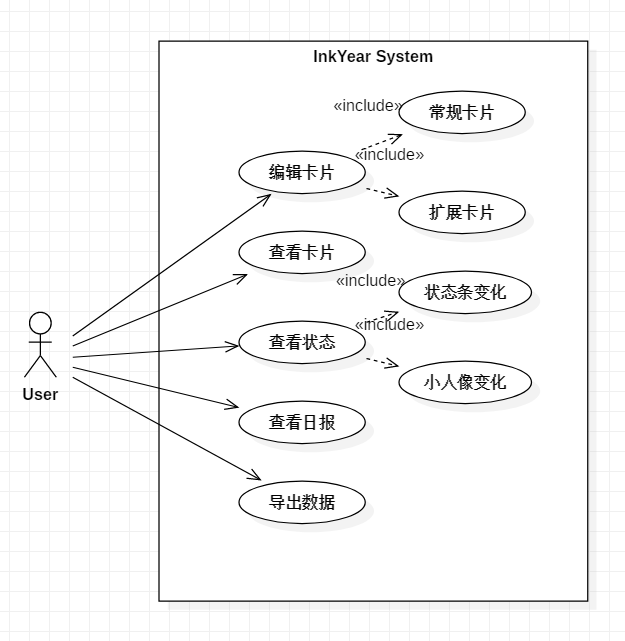  
- 系统顺序图  
  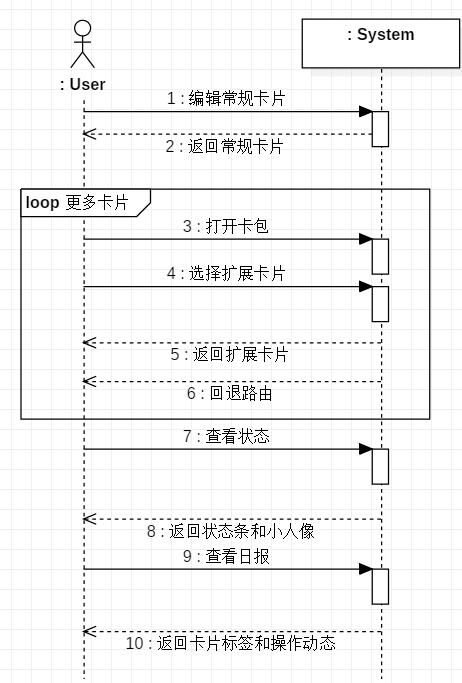  

### 2.2 技术选型

#### 2.2.1 UI：Flutter

flutter是谷歌开发的一款移动UI框架，能够快速在IOS和Android系统上构建高质量原生用户界面。

相较于其他UI，其优势在于：

- 快速开发  
  - Flutter的热重载帮助你快捷方便的试验、重构UI、添加特性和修复bug。在仿真器、模拟器和ios、android硬件上体验亚秒级的重载，而不会丢失状态。
- 绚丽UI  
  - 通过Flutter内建的漂亮的质感设计和Cupertino（ios-flavor）小工具、丰富的动画API，平滑的自然滚动和平台感知，让用户感到满意。
- 响应式  
  - 通过Flutter的现代响应式(Reactive)框架和丰富的平台布局和基础组件轻松构建您的用户界面。用强大而灵活的API解决2D、动画、手势、效果等难题。
- 可跨平台及混合开发  
  - 通过平台api、第三方sdk和原生代码使您的应用变得生动起来。Flutter让您可以重用您现有的java、swift和Objc代码，并在iOS和Android上访问原生特性和SDK。

控件树设计示意图  
  

#### 2.2.2 Database：SQLite

SQLite是一款轻量级的数据库，其设计目标是嵌入式的，占用资源非常低。相较于MySql与postgreSQL来说，它的处理速度更快。

其优势在于：

- 不需要一个单独的服务器进程或操作的系统
- SQLite 不需要配置，这意味着不需要安装或管理
- SQLite 是非常小的，是轻量级的，完全配置时小于 400KiB，省略可选功能配置时小于250KiB
- SQLite 是自给自足的，这意味着不需要任何外部的依赖

数据库设计示意图  
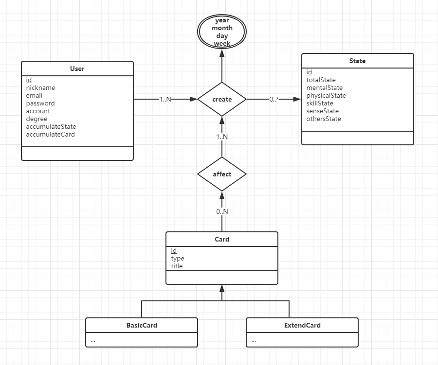  

### 2.3 运行环境

- Android
- iOS [由于iOS打包需要开发者账号等，时间原因我们延缓iOS版本的发布，原则上iOS亦可运行]

## 三、项目开发计划

### 3.1 任务分工表

| 任务代号 | 任务名称           | 黄秀萍(组长) | 刘皓贤 | 苏恒 | 曾志豪 | 陈俊言 |
| -------- | ---------------------- | ------------ | ------ | ---- | ------ | ------ |
| A0       | 可行性及需求分析 | √          | √    | √  | √    | √    |
| A1       | 开发计划及任务分工 | √          | √    | √  | √    | √    |
| A2       | 用例图及系统顺序图制作 |              |        |      |        | √    |
| A3       | 控件树图制作     | √          |        |      |        |        |
| A4       | 数据库图制作     | √          |        |      |        |        |
| A5       | 设计原型及功能列表 | √          |        |      |        |        |
| A6       | 卡片页面绘制     |              | √    |      |        |        |
| A7       | 日历页面绘制     |              |        |      | √    |        |
| A8       | 状态页面绘制     |              | √    |      |        |        |
| A9       | 脚手架绘制        |              | √    |      |        |        |
| A10      | 侧边栏绘制        |              |        | √  |        |        |
| A11      | 卡包界面绘制     |              | √    |      |        |        |
| A12      | 个人界面绘制     |              |        | √  |        |        |
| A13      | 启动页面绘制     |              |        |      | √    |        |
| A14      | 数据库设计与搭建 | √          |        |      |        |        |
| A15      | 测试集成打包     | √          |        |      |        |        |
| A16      | 软件项目开发文档 |              |        |      |        | √    |

### 3.2 开发时间表

| 第一周 | 第二周 | 第三周 | 第四周 |
| ------ | ------ | ------ | ------ |
| A1     | A3     | A14    | A14    |
| A2     | A4     | A5     | A15    |
| A3     | A5     | A6     | A16    |
| A4     | A9     | A7     |        |
| A5     | A10    | A8     |        |
|        | A12    | A11    |        |
|        | A13    |        |        |

## 四、项目功能列表

- 详见演示视频[受环境因素影响，噪音有点大]

### 4.1 启动界面

  

1. 问候用户，体现出本App的图标和名称
2. 进行App前端和后端初始化
3. 点击进入或倒计时进入程序

### 4.2 脚手架

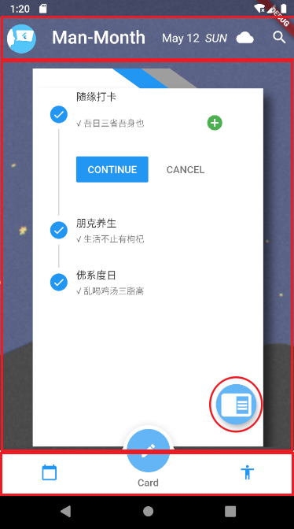
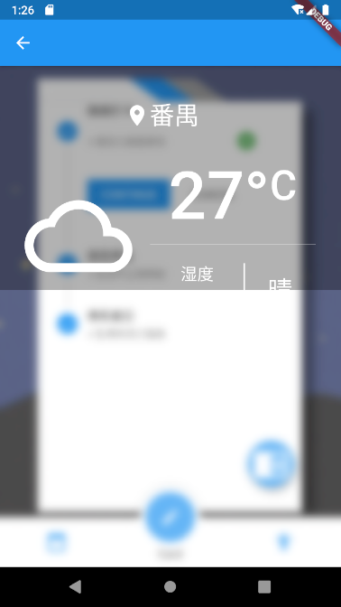  

1. 顶部栏：左部为用户头像和用户昵称，点击用户头像可唤出侧边栏，中间为当天的日期信息和天气信息，点击天气图标可调用API获取选择地区的天气信息，最右为搜索项，用于搜索卡片的内容定位相关的卡片
2. 主体：App执行主要操作页面所放置的位置
3. 底部栏：动画精美，用于切换标签页（TabView）

### 4.3 侧边栏

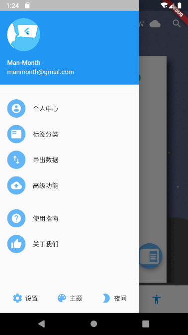
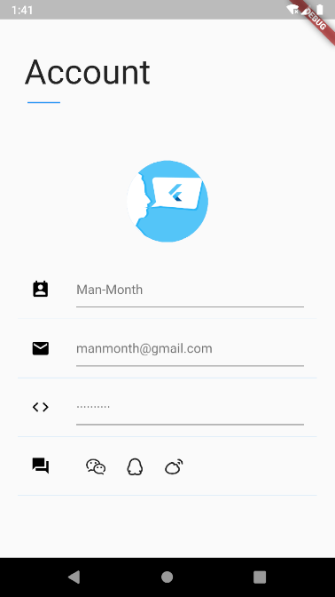
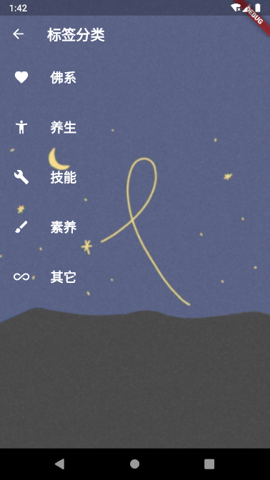
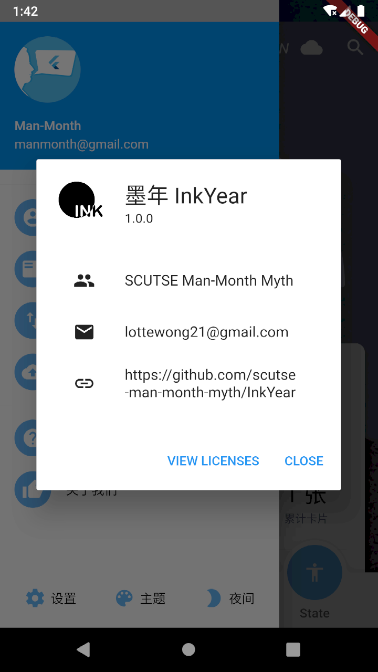  

1. 从左边缘右滑或点击左上角头像可以唤出侧边栏。在侧边栏顶部可以看到自己的账号信息（昵称以及邮箱）。未登录的话点击账号信息会跳转到登录页面。已登录的话点击会跳转到个人中心，可以在个人中心页面进行更改密码等操作，个人中心也可以通过点击侧边栏的“个人中心”一栏进入。
2. 点击“标签分类”一栏可以进入标签管理页，在这里添加卡片可以携带的标签种类。
3. “导出数据”一栏可以把存储的数据导出为txt或word格式文件。
4. “关于我们”一栏可以查看软件的版本和开发者信息。

### 4.4 卡片界面

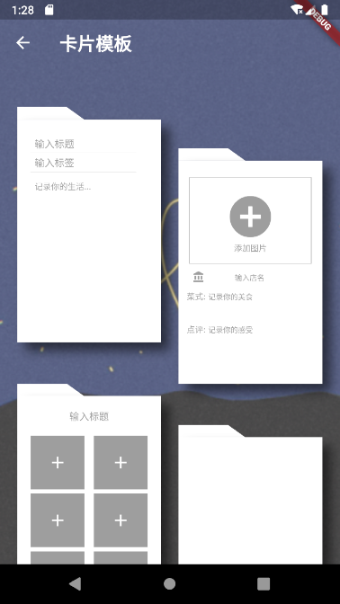
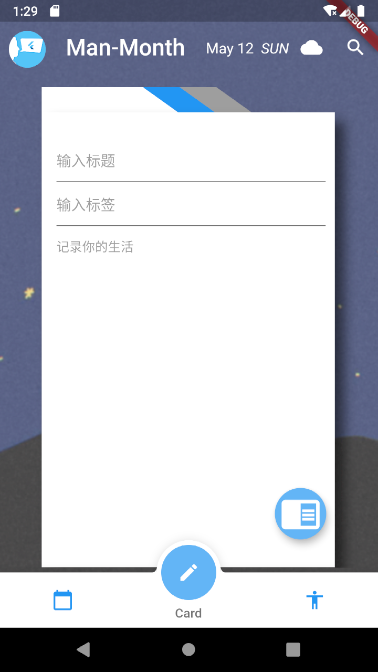
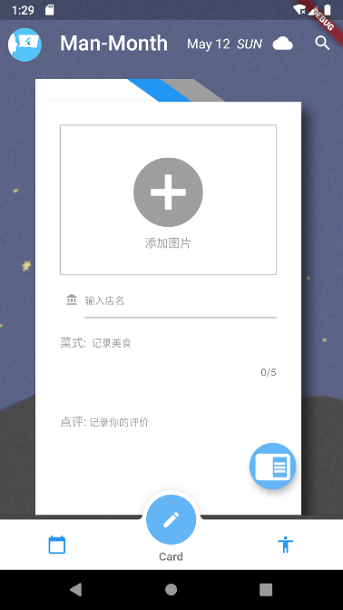  

1. 中间是一张卡片，初始是一张常规卡片，可以进行填写记录，点击卡片的顶部会进入查看今天写过的所有卡片页面，左右滑动卡片会出现不同日期的卡片。
2. 右下角的悬浮按钮，点击后进入选择卡片模版的卡包页面。
3. 制作许多不同的卡片模版，点击模版就是选择模版然后返回到编辑卡片页面，卡片里的内容会被替换为你选择的那个模版

### 4.5 日历界面

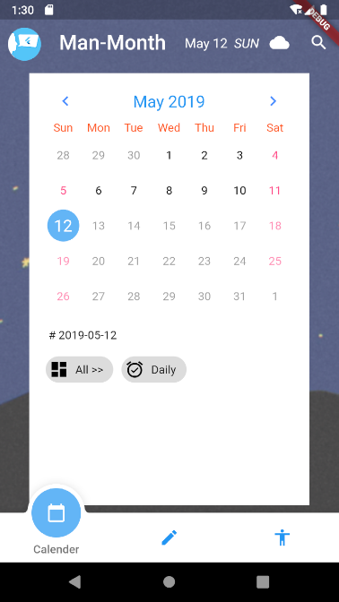

1. 能显示一个普通的日历，当日后面的日期数字变灰，有写日历的那天在日历上作圆圈️标记并且可以点进去查看当天日记情况。
2. 日历底下是一些当日日记的标签，每写一篇日记，就会生成一个标签，标签可点进去查看该篇日记

### 4.6 状态界面

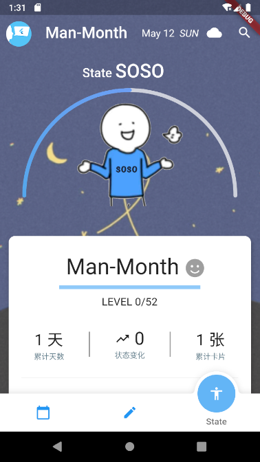

1. 顶部可以看到以图形呈现的小人和总状态值
2. 底部可以看到小人的各种状态值和使用这软件的天数和编辑过的卡片数量等信息

## 五、项目后续进展

- 连接
  - Organization: [SCUTSE Man-Month Myth](https://github.com/scutse-man-month-myth)
  - Repository: [墨年 InkYear](https://github.com/scutse-man-month-myth/InkYear)
  - Email: lottewong21@gmail.com
- 完善
  - 继续开发尚未完善的功能
  - 优化代码结构
- 发布
  - 拟发布到Android和iOS应用商店
  - 收集反馈，不断迭代
- 维护
  - MIT License开源，将长期维护
  - 欢迎大家来Fork
- 总结
  - 项目管理
  - 团队合作
  - 开发流程
  - 开发架构
  - 代码能力
